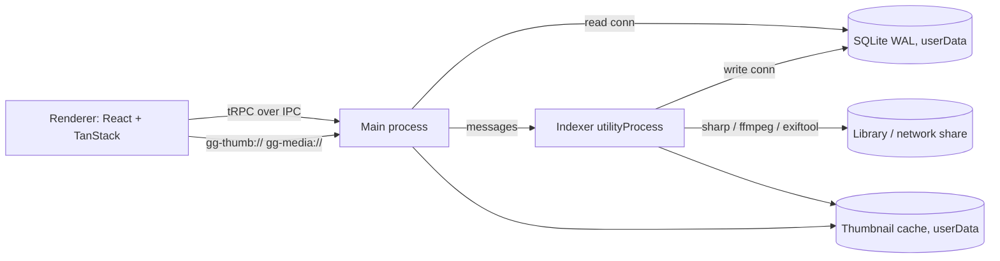

# Good Gallery

A Windows desktop gallery for large photo and video libraries (50k–500k files). Media appear in a virtualized masonry grid. Libraries on network shares are supported, and thumbnails are cached locally. Search uses the tags that are already embedded in your files.

## Features

- **Masonry grid:** virtualized, so it stays fast at any library size. Zoom with the slider, the +/- buttons or Ctrl + mouse wheel.
- **Network shares:** libraries can live on `\\server\share`. Thumbnails (WebP and ThumbHash placeholders) are cached locally, and the cached index stays browsable while a share is offline.
- **Change detection:** a file watcher picks up changes, plus periodic quick scans. Manual rescans are also possible.
- **Search:** combine tags (include or exclude, hierarchical), filename text, folder, date range, rating and media type. Sort by date taken, date modified, name, path or size.
- **Sidebar:** libraries with a folder tree, People and Places (from keyword hierarchies and face regions), ratings and popular tags.
- **Viewer:** keyboard navigation, zoom and pan, video playback, a metadata panel and "Show in Explorer".
- **Read-only:** tags and ratings come from EXIF / IPTC / XMP and `.xmp` sidecars. Files are never modified.

Supported formats: JPEG, PNG, WebP, GIF and AVIF images, plus videos (with poster-frame thumbnails).

## Requirements

- Windows
- Node 24 and pnpm 12. The versions are pinned in `mise.toml`.

## Getting started

```sh
pnpm install
pnpm dev
```

Add a library folder under **Settings**.

| Script            | Purpose                                                         |
| ----------------- | --------------------------------------------------------------- |
| `pnpm dev`        | Run the app with hot reload                                     |
| `pnpm build`      | Build into `out/`                                               |
| `pnpm dist`       | Build the NSIS installer into `release/<version>/`              |
| `pnpm format`     | Format and lint with Biome (`pnpm lint` only checks)            |
| `pnpm typecheck`  | Type-check the node, web and e2e projects                       |
| `pnpm test`       | Unit tests (Vitest)                                             |
| `pnpm test:e2e`   | Build, then run the Playwright Electron smoke test              |
| `pnpm db:generate`| Generate a Drizzle migration after changing the schema         |

## Architecture



| Folder          | Role                                                                                        |
| --------------- | ------------------------------------------------------------------------------------------- |
| `src/main`      | Window and security, tRPC router over IPC, custom protocols, settings, scan scheduling      |
| `src/indexer`   | `utilityProcess`: scanning, file watcher, metadata (exiftool), thumbnails (sharp / ffmpeg)  |
| `src/preload`   | Exposes only the tRPC IPC transport through `contextBridge`                                |
| `src/renderer`  | React UI (TanStack Router / Query / Virtual, shadcn, Tailwind)                              |
| `src/shared`    | Code used by several processes (settings schema, tag helpers, media URLs, …)                |
| `drizzle/`      | SQL migrations, shipped with the app and applied at startup                                 |
| `e2e/`          | Playwright smoke test against a generated fixture library                                   |

## Tech stack

- **Shell:** Electron, electron-vite, Vite
- **UI:** React, Tailwind CSS, shadcn/ui, TanStack Router / Query / Virtual
- **API:** tRPC over a custom IPC link, zod, superjson
- **Data:** better-sqlite3, Drizzle ORM
- **Media:** sharp, exiftool-vendored, ffmpeg-static, thumbhash
- **Tooling:** TypeScript 7, Biome, Vitest, Playwright, electron-builder

## License note

`ffmpeg-static` bundles a GPL-3.0 ffmpeg build. For closed-source distribution, use an LGPL build instead.
