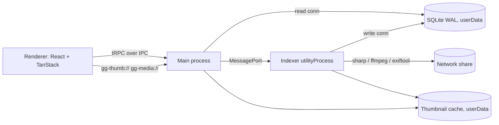

# Good Gallery – Project Plan

Modern Electron gallery app with a cascading (masonry/waterfall) image display, network-drive support with thumbnail caching, and tag-based search.

## Scope (v1)

- **Platform:** Windows only
- **Media:** JPEG / PNG / WebP / GIF / AVIF images + videos (poster-frame thumbnails)
- **Scale:** 50k–500k files per install
- **Tags:** read-only, from embedded metadata (EXIF / IPTC / XMP) and `.xmp` sidecars
- **Index storage:** local SQLite per user (Electron `userData`)

**Out of scope for v1:** manual tagging, writing tags back to files, AI auto-tagging, HEIC/RAW, macOS/Linux, shared multi-user DB.

## Tech Stack (versions verified 2026-09-25)

| Area           | Choice                                                                                                            |
| -------------- | ----------------------------------------------------------------------------------------------------------------- |
| Shell / build  | electron 44.4.5, electron-vite **6.0.0-beta.1**, vite 8.3.1, @vitejs/plugin-react 6.1.1                           |
| UI             | react 19.3.0, tailwindcss 4.3.3 (`@tailwindcss/vite`), shadcn 4.21.0, lucide-react, motion                        |
| Data / routing | @tanstack/react-query 5.103.2, @tanstack/react-router 1.170.39 (+ router-plugin), @tanstack/react-virtual 3.14.13 |
| API            | @trpc/server + client + tanstack-react-query 11.19.0, zod 4.6.5, superjson                                        |
| DB             | better-sqlite3 13.0.3, drizzle-orm 0.45.2, drizzle-kit 0.31.10                                                    |
| Media          | sharp 0.35.4, exiftool-vendored 38.2.0, ffmpeg-static 5.3.0, thumbhash, p-queue 9.3.3                             |
| Tooling        | typescript 7.0.2, @biomejs/biome 2.5.14, vitest 5.0.2, pnpm 12.6.0, electron-builder 26.15.3, Playwright (e2e)    |

### Stack decisions

- **electron-vite 6 beta** – stable 5.0 only supports Vite ≤7. Fallback: electron-vite 5 + Vite 7.
- **TypeScript 7 (native)** – typescript-eslint doesn't support it, so Biome handles lint/format and `tsc` handles type checking.
- **Own tRPC IPC link** – `electron-trpc` is tRPC v10 only; `trpc-electron` (v11) is unmaintained since Jan 2025.
- **better-sqlite3** – v13 ships N-API prebuilds, so no Electron ABI rebuild is needed; `node:sqlite` is an alternative if Drizzle support matures.

## Architecture

- **main** – window, security, tRPC router over IPC, custom protocols, read-only DB connection
- **indexer** (`utilityProcess`) – scanning, metadata, thumbnail generation, write DB connection
- **preload** – `contextBridge` exposes only the tRPC IPC transport
- **renderer** – React UI

## Phases

### Phase 0 – Scaffold & tooling ✅

1. electron-vite project layout: `src/main`, `src/preload`, `src/renderer`, `src/indexer` (second main entry), `src/shared`.
2. pnpm with `node-linker=hoisted`, allowed build scripts for native deps, `electron-builder install-app-deps` postinstall.
3. Biome (lint + format), TS 7 `tsc --noEmit` via project references (node / web), Vitest. Scripts: `dev`, `build`, `typecheck`, `lint`, `test`, `dist`.
4. Tailwind v4 via `@tailwindcss/vite`, `shadcn init` (alias `@/`), dark-first theme.

Notes from implementation:

- Toolchain pinned via `mise.toml` (Node 24, pnpm 12.6). pnpm ≥11 reads settings only from `pnpm-workspace.yaml` (`nodeLinker`, `allowBuilds`), not `.npmrc`.
- ESM main process (`"type": "module"`); preload forced to CJS (`index.cjs`) because sandboxed preloads can't be ESM.
- Electron 44 downloads its binary lazily, but electron-vite reads `path.txt` directly → `postinstall` runs `install-electron` first.
- shadcn can't detect electron-vite; `components.json` points at `src/renderer/src/styles.css` and `shadcn add <component>` works as-is (preset: radix-nova).
- Renderer-only packages are `devDependencies` (bundled by Vite); `dependencies` is reserved for main/indexer runtime modules.
- `src/indexer` is created in Phase 2 (loaded via `?modulePath` import, no extra config entry needed).

### Phase 1 – Main process foundation ✅

1. Security: `contextIsolation`, `sandbox`, no `nodeIntegration`, strict CSP (`self`, `gg-thumb:`, `gg-media:`), block navigation and `window.open`.
2. Drizzle schema (`src/main/db/schema.ts`):
   - `library_roots` (id, path, label, status, last_scan_at)
   - `media` (id, root_id, rel_path, file_name, kind, size, mtime, width, height, duration, taken_at, thumbhash, thumb_status; unique(root_id, rel_path))
   - `tags` (id, name, name_norm unique, parent_id)
   - `media_tags` (media_id, tag_id; PK + reverse index)
   - WAL mode, drizzle-kit migrations shipped as resources, `migrate()` at startup.
3. Custom tRPC-over-IPC link: single `ipcMain` channel for query/mutation/subscription, `contextBridge` transport, renderer `TRPCLink`, async-generator subscriptions, superjson.
4. Routers: `libraries` (add/remove/list/rescan), `media` (paged search), `tags` (autocomplete), `indexer` (status subscription).

Notes from implementation:

- better-sqlite3 13 ships N-API prebuilds (ABI-stable for Node and Electron) → no rebuild: `allowBuilds: false`, `install-app-deps` removed from `postinstall`, `npmRebuild: false` in electron-builder. Vitest uses the same binary under Node.
- pnpm's `minimumReleaseAge` blocked drizzle-orm 0.45.3 and react-query 5.103.2 (too new) → using 0.45.2 / 5.103.1.
- drizzle-kit mangles expression indexes, so `media.sort_date` is a virtual generated column (`coalesce(taken_at, mtime)`) with indexes `(sort_date, id)` and `(root_id, sort_date, id)`. Keyset pagination uses row-value comparison `(sort, id) < (?, ?)`.
- Timestamps are integer ms; `thumbhash` is base64 text (superjson has no typed-array support).
- Main currently owns a read-write connection (runs migrations, writes `library_roots`); Phase 2 moves bulk writes to the indexer.
- IPC: `src/shared/trpc-ipc.ts` (protocol), `src/main/trpc/ipc-server.ts` (transport-agnostic, tested in-process), `ipc-main.ts` (Electron wiring: main-frame + trusted-URL check, zod-validated messages, aborts on reload/destroy), `src/renderer/src/lib/ipc-link.ts`.
- `IndexerController` (`src/main/indexer.ts`) only tracks the scan queue until Phase 2.
- Renderer imports `AppRouter` type-only via the `@main/*` path alias (web tsconfig only).
- Migrations: `pnpm db:generate` → `drizzle/`; packaged as `extraResources` → `resources/migrations`.

### Phase 2 – Indexer

1. `utilityProcess` with its own DB write connection, MessagePort to main.
2. Scanner: streaming `fs.opendir`, extension filter, diff by (size, mtime), batched transactions (~1k rows), p-queue I/O concurrency (~4, configurable).
3. Metadata via exiftool-vendored (batch mode): dimensions, capture date, duration, tags from `XMP-dc:Subject`, `IPTC:Keywords`, `XMP-lr:HierarchicalSubject` (split on `|`), `XPKeywords`; read `.xmp` sidecars. Normalize tags (trim, case-fold, dedupe).
4. Network resilience: root reachability check with timeout (online/offline), scheduled + manual rescans (`fs.watch` is unreliable on SMB), retry with backoff, cached browsing while offline.

### Phase 3 – Thumbnails & protocols

 1. Thumbnails: sharp → WebP at 400w and 800w (HiDPI); prefer embedded JPEG preview when large enough (avoids full reads over SMB); ffmpeg frame at ~10% for videos; compute thumbhash into DB.
 2. Cache: `userData/thumbs/ab/cd/<sha1(rootId+relPath+size+mtime+w)>.webp`, LRU eviction with configurable size cap.
 3. Priority queue: background generation for new files, on-demand requests for visible items take priority.
 4. `protocol.handle`: `gg-thumb://<id>/<w>` (cache or generate) and `gg-media://<id>` (stream originals with Range support). IDs only, resolved via DB — no raw paths.

### Phase 4 – Masonry gallery UI

 1. TanStack Router, file-based routes, **hash history**: `/`, `/settings`, `/media/$id` (viewer overlay).
 2. Search state in Zod-validated URL search params (tags include/exclude, root, kind, sort).
 3. `useInfiniteQuery` via `trpc.media.search.infiniteQueryOptions`, cursor pagination (~200/page).
 4. Virtualized masonry: `useVirtualizer` with `lanes`, heights from stored width/height, thumbhash placeholder → fade-in, zoom slider controls column count.
 5. Layout: shadcn Sidebar (libraries, folders, popular tags), top search bar, Skeleton, Sonner toasts, indexer progress, offline badges.

### Phase 5 – Tag search

 1. shadcn `Command` combobox with prefix autocomplete (by `name_norm`, usage counts), Badge chips, include/exclude toggle (`-tag`).
 2. SQL: include-all (`IN … GROUP BY … HAVING COUNT = n`), `NOT EXISTS` for exclusions, hierarchical tags match descendants; filters for root, folder prefix, kind, date range. Validate with `EXPLAIN QUERY PLAN` on a 500k-row synthetic DB.

### Phase 6 – Viewer & polish

 1. Lightbox: keyboard nav, zoom/pan, video via `gg-media://`, metadata/tag panel, "Show in Explorer".
 2. Settings: library roots (folder picker), cache size + clear, rescan interval, I/O concurrency.

### Phase 7 – Packaging & e2e

 1. electron-builder NSIS; `asarUnpack` for sharp, better-sqlite3, exiftool `.exe`, ffmpeg; migrations as `extraResources`.
 2. Playwright `_electron` smoke test: launch → add fixture library → index → search tag → open viewer.

## Verification

1. `pnpm typecheck`, `pnpm lint`, `pnpm test` pass in CI.
2. Unit tests: scanner diffing (temp dirs), tag normalization/hierarchy, search query builder (in-memory SQLite), cache-key stability, protocol handler rejects unknown IDs.
3. Performance: 500k synthetic rows → search p95 < ~50 ms; 60 fps scrolling.
4. Manual: index `\\server\share`, disconnect → cached browsing + offline badge, reconnect → incremental rescan.
5. Playwright e2e + packaged NSIS install on a clean Windows VM.

## Open Considerations

1. **ffmpeg-static is GPL-3.0** – fine for personal/OSS; for closed distribution use an LGPL build or Chromium `<video>` frame capture (no HEVC).
2. **SQLite driver** – better-sqlite3 (recommended) vs. built-in `node:sqlite` (no native rebuild, Drizzle support uncertain).
3. **pnpm via mise** – may need a `pnpm.cmd` shim for Electron tooling on Windows.
