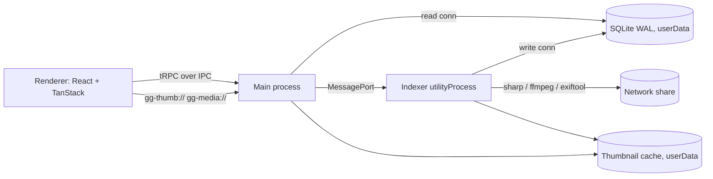

# Good Gallery – Project Plan

Modern Electron gallery app with a cascading (masonry/waterfall) image display, network-drive support with thumbnail caching, and tag-based search.

## Scope (v1)

- **Platform:** Windows only
- **Media:** JPEG / PNG / WebP / GIF / AVIF images + videos (poster-frame thumbnails)
- **Scale:** 50k–500k files per install
- **Tags:** read-only, from embedded metadata (EXIF / IPTC / XMP) and `.xmp` sidecars
- **Index storage:** local SQLite per user (Electron `userData`)

**Out of scope for v1:** manual tagging, writing tags back to files, AI auto-tagging, HEIC/RAW, macOS/Linux, shared multi-user DB.

## Tech Stack (versions verified 2026-09-25)

| Area           | Choice                                                                                                                     |
| -------------- | -------------------------------------------------------------------------------------------------------------------------- |
| Shell / build  | electron 44.4.5, electron-vite **6.0.0-beta.1**, vite 8.3.1, @vitejs/plugin-react 6.1.1                                    |
| UI             | react 19.3.0, tailwindcss 4.3.3 (`@tailwindcss/vite`), shadcn 4.21.0, lucide-react, motion                                 |
| Data / routing | @tanstack/react-query 5.103.2, @tanstack/react-router 1.170.38 (+ router-plugin 1.168.40), @tanstack/react-virtual 3.14.13 |
| API            | @trpc/server + client + tanstack-react-query 11.19.0, zod 4.6.5, superjson                                                 |
| DB             | better-sqlite3 13.0.3, drizzle-orm 0.45.2, drizzle-kit 0.31.10                                                             |
| Media          | sharp 0.35.4, exiftool-vendored 38.1.0, ffmpeg-static 5.3.0, thumbhash, p-queue 9.3.3                                      |
| Tooling        | typescript 7.0.2, @biomejs/biome 2.5.14, vitest 5.0.2, pnpm 12.6.0, electron-builder 26.15.3, Playwright (e2e)             |

### Stack decisions

- **electron-vite 6 beta** – stable 5.0 only supports Vite ≤7. Fallback: electron-vite 5 + Vite 7.
- **TypeScript 7 (native)** – typescript-eslint doesn't support it, so Biome handles lint/format and `tsc` handles type checking.
- **Own tRPC IPC link** – `electron-trpc` is tRPC v10 only; `trpc-electron` (v11) is unmaintained since Jan 2025.
- **better-sqlite3** – v13 ships N-API prebuilds, so no Electron ABI rebuild is needed; `node:sqlite` is an alternative if Drizzle support matures.

## Architecture

- **main** – window, security, tRPC router over IPC, custom protocols, read-only DB connection
- **indexer** (`utilityProcess`) – scanning, metadata, thumbnail generation, write DB connection
- **preload** – `contextBridge` exposes only the tRPC IPC transport
- **renderer** – React UI

## Phases

### Phase 0 – Scaffold & tooling ✅

1. electron-vite project layout: `src/main`, `src/preload`, `src/renderer`, `src/indexer` (second main entry), `src/shared`.
2. pnpm with `node-linker=hoisted`, allowed build scripts for native deps, `electron-builder install-app-deps` postinstall.
3. Biome (lint + format), TS 7 `tsc --noEmit` via project references (node / web), Vitest. Scripts: `dev`, `build`, `typecheck`, `lint`, `test`, `dist`.
4. Tailwind v4 via `@tailwindcss/vite`, `shadcn init` (alias `@/`), dark-first theme.

Notes from implementation:

- Toolchain pinned via `mise.toml` (Node 24, pnpm 12.6). pnpm ≥11 reads settings only from `pnpm-workspace.yaml` (`nodeLinker`, `allowBuilds`), not `.npmrc`.
- ESM main process (`"type": "module"`); preload forced to CJS (`index.cjs`) because sandboxed preloads can't be ESM.
- Electron 44 downloads its binary lazily, but electron-vite reads `path.txt` directly → `postinstall` runs `install-electron` first.
- shadcn can't detect electron-vite; `components.json` points at `src/renderer/src/styles.css` and `shadcn add <component>` works as-is (preset: radix-nova).
- Renderer-only packages are `devDependencies` (bundled by Vite); `dependencies` is reserved for main/indexer runtime modules.
- `src/indexer` is created in Phase 2 (loaded via `?modulePath` import, no extra config entry needed).

### Phase 1 – Main process foundation ✅

1. Security: `contextIsolation`, `sandbox`, no `nodeIntegration`, strict CSP (`self`, `gg-thumb:`, `gg-media:`), block navigation and `window.open`.
2. Drizzle schema (`src/main/db/schema.ts`):
   - `library_roots` (id, path, label, status, last_scan_at)
   - `media` (id, root_id, rel_path, file_name, kind, size, mtime, width, height, duration, taken_at, thumbhash, thumb_status; unique(root_id, rel_path))
   - `tags` (id, name, name_norm unique, parent_id)
   - `media_tags` (media_id, tag_id; PK + reverse index)
   - WAL mode, drizzle-kit migrations shipped as resources, `migrate()` at startup.
3. Custom tRPC-over-IPC link: single `ipcMain` channel for query/mutation/subscription, `contextBridge` transport, renderer `TRPCLink`, async-generator subscriptions, superjson.
4. Routers: `libraries` (add/remove/list/rescan), `media` (paged search), `tags` (autocomplete), `indexer` (status subscription).

Notes from implementation:

- better-sqlite3 13 ships N-API prebuilds (ABI-stable for Node and Electron) → no rebuild: `allowBuilds: false`, `install-app-deps` removed from `postinstall`, `npmRebuild: false` in electron-builder. Vitest uses the same binary under Node.
- pnpm's `minimumReleaseAge` blocked drizzle-orm 0.45.3 and react-query 5.103.2 (too new) → using 0.45.2 / 5.103.1.
- drizzle-kit mangles expression indexes, so `media.sort_date` is a virtual generated column (`coalesce(taken_at, mtime)`) with indexes `(sort_date, id)` and `(root_id, sort_date, id)`. Keyset pagination uses row-value comparison `(sort, id) < (?, ?)`.
- Timestamps are integer ms; `thumbhash` is base64 text (superjson has no typed-array support).
- Main currently owns a read-write connection (runs migrations, writes `library_roots`); Phase 2 moves bulk writes to the indexer.
- IPC: `src/shared/trpc-ipc.ts` (protocol), `src/main/trpc/ipc-server.ts` (transport-agnostic, tested in-process), `ipc-main.ts` (Electron wiring: main-frame + trusted-URL check, zod-validated messages, aborts on reload/destroy), `src/renderer/src/lib/ipc-link.ts`.
- `IndexerController` (`src/main/indexer.ts`) only tracks the scan queue until Phase 2.
- Renderer imports `AppRouter` type-only via the `@main/*` path alias (web tsconfig only).
- Migrations: `pnpm db:generate` → `drizzle/`; packaged as `extraResources` → `resources/migrations`.

### Phase 2 – Indexer ✅

1. `utilityProcess` with its own DB write connection, MessagePort to main.
2. Scanner: streaming `fs.opendir`, extension filter, diff by (size, mtime), batched transactions (~1k rows), p-queue I/O concurrency (~4, configurable).
3. Metadata via exiftool-vendored (batch mode): dimensions, capture date, duration, tags from `XMP-dc:Subject`, `IPTC:Keywords`, `XMP-lr:HierarchicalSubject` (split on `|`), `XPKeywords`; read `.xmp` sidecars. Normalize tags (trim, case-fold, dedupe).
4. Network resilience: root reachability check with timeout (online/offline), scheduled + manual rescans (`fs.watch` is unreliable on SMB), retry with backoff, cached browsing while offline.

Notes from implementation:

- exiftool-vendored pinned to 38.1.0 (38.2.0 blocked by `minimumReleaseAge`).
- Layout: `src/indexer/index.ts` (utilityProcess entry, loaded via `?modulePath`), `scan.ts` (orchestration), `walk.ts` (iterative `opendir` walk, skips dot/`$`/NAS housekeeping dirs and AppleDouble files), `metadata.ts` (exiftool → dimensions/date/duration/tags), `writer.ts` (all DB writes), `protocol.ts` (zod-validated messages). Main: `indexer.ts` (`IndexerController`, transport-agnostic via `IndexerWorker`), `indexer-process.ts` (Electron fork), `rescan.ts`.
- Uses the utilityProcess `parentPort` instead of a separate MessagePort; config (`dbPath`, concurrency) arrives in an `init` message. Main keeps the scan queue and runs one scan at a time; the worker is spawned lazily and respawned after a crash.
- Main runs migrations before forking; the indexer opens its connection without migrating.
- Change detection: `(size, mtime, sidecar_mtime)`; new column `media.sidecar_mtime`. Thumbnails reset to `pending` only on content changes, not sidecar-only changes.
- Deletion: files not seen during a completed scan are removed, except under directories that failed to list. Cancelled scans write nothing (the root may be gone); offline scans keep everything and flush what was read.
- Offline detection mid-scan: transient I/O or exiftool errors trigger a reachability check; if the root is gone the scan aborts with `offline`.
- Tags: `HierarchicalSubject` → parent chain (first hierarchy seen wins, cycles refused), media linked to the leaf only; flat keywords that appear in a hierarchy are dropped (Lightroom writes both). Orphan tags are pruned after each completed scan.
- Schedule: all roots at startup and every 30 min, offline roots every 60 s, I/O concurrency 4 (constants in `main/index.ts` until Phase 6 settings).

### Phase 3 – Thumbnails & protocols ✅

 1. Thumbnails: sharp → WebP at 400w and 800w (HiDPI); prefer embedded JPEG preview when large enough (avoids full reads over SMB); ffmpeg frame at ~10% for videos; compute thumbhash into DB.
 2. Cache: `userData/thumbs/ab/cd/<sha1(rootId+relPath+size+mtime+w)>.webp`, LRU eviction with configurable size cap.
 3. Priority queue: background generation for new files, on-demand requests for visible items take priority.
 4. `protocol.handle`: `gg-thumb://media/<id>/<w>` (cache or generate) and `gg-media://media/<id>` (stream originals with Range support). IDs only, resolved via DB — no raw paths.

Notes from implementation:

- Layout: indexer `thumbnail.ts` (decode + render), `thumb-cache.ts` (cache key + `ThumbCache`), `thumbnails.ts` (`ThumbnailService` queue); main `protocols.ts` (fetch-style handlers, tested without Electron); `shared/media-urls.ts` (URL build/parse, thumb widths).
- URLs carry a fixed `media` host: standard schemes canonicalize numeric hosts as IPv4 (`gg-thumb://12` → `//0.0.0.12`).
- One decode per file → resized to ≤800×2400 raw → both WebP widths + ThumbHash (≤100 px). `sharp.cache(false)` so libvips doesn't hold SMB files open.
- Embedded preview: exiftool `PreviewImage`, used when its oriented width ≥ min(800, original) and its aspect matches the original within 2 %. The preview gets the original's EXIF orientation applied explicitly (`orient()`, mapping verified against sharp's auto-orient in tests).
- Videos: `ffmpeg -ss <10 % of duration> -i … -frames:v 1` as PNG over stdout; binary path rewritten to `app.asar.unpacked` for packaging. `ffmpeg-static` postinstall downloads the binary (`allowBuilds: true`).
- Queue: one p-queue (I/O concurrency) with priorities — background 0, on-demand an increasing counter (latest request first, since earlier ones have likely scrolled away); already queued background jobs get bumped via `setPriority`. Background pulls pending media newest first in batches of 100 (index `media_thumb_idx (thumb_status, sort_date)`), skipping offline roots, and is kicked on init and scan progress.
- Failures: if the root is still reachable the media is marked `error` (main then answers 404 without retrying); otherwise the root is set offline and the media stays `pending`. Results are only stored if size/mtime didn't change during rendering.
- Cache: size measured at startup (crash leftovers `*.tmp` removed), atomic writes (temp + rename), eviction by file mtime down to 90 % of the cap; main bumps a thumbnail's mtime when serving it (at most hourly). Background work stops writing files once the cache is full (it still stores the ThumbHash), so it never evicts thumbnails that were actually viewed. Cap: 5 GiB constant in `main/index.ts` until Phase 6.
- Main asks the indexer via `{ type: 'thumbnail', mediaId }` and awaits the reply (`IndexerController.requestThumbnail`, deduplicated, failed on worker exit).
- `gg-media` parses a single `bytes=` range (multi-range → full 200, out of range → 416) and streams via `createReadStream`; the scheme is registered with `stream: true` for `<video>` seeking.

### Phase 4 – Masonry gallery UI ✅

 1. TanStack Router, file-based routes, **hash history**: `/`, `/settings`, `/media/$id` (viewer overlay).
 2. Search state in Zod-validated URL search params (root, kind, sort; tags follow in Phase 5).
 3. `useInfiniteQuery` via `trpc.media.search.infiniteQueryOptions`, cursor pagination (~200/page).
20. Virtualized masonry (`components/masonry-grid.tsx`, no masonry library): `@tanstack/react-virtual` `useVirtualizer` with `lanes` = column count (shortest-lane placement).
    - Heights computed up front from stored width/height (`lib/masonry.ts`) → no DOM measuring; aspect clamped to 0.3–3, square fallback for unknown dimensions.
    - Container width via `ResizeObserver`; whole-pixel column width; absolute positioning via `translate(lane * (colWidth + gap), start)`.
    - Zoom slider sets column count; on zoom/resize `measure()` + `scrollToIndex(firstVisible)` to keep scroll position.
    - Infinite loading: `fetchNextPage()` when the last rendered index nears `items.length`.
    - Pick 400w vs 800w thumb by `colWidth * devicePixelRatio`; thumbhash background → CSS opacity fade-in on `onLoad` (no `motion` per tile).
    - Alternatives rejected: CSS columns / `react-masonry-css` (not virtualized, column-major order), CSS `grid-lanes` (not virtualized), `masonic` (unmaintained). Possible later second view mode: justified rows (exact chronological order).
 5. Layout: shadcn Sidebar (libraries), Skeleton, Sonner toasts, indexer progress, offline badges.

Notes from implementation:

- Routes (`src/renderer/src/routes`, tree generated into `route-tree.gen.ts` by `@tanstack/router-plugin`, committed, excluded from Biome): `__root` (sidebar + toaster), pathless `_gallery` layout (validates search, renders toolbar + grid + `<Outlet>`), `_gallery/index`, `_gallery/media.$id` (overlay, so the grid keeps its scroll position), `settings`.
- Zoom (2–12 columns) persists in `localStorage`, not the URL.
- `useIndexerStatus` (single subscription in the root) invalidates `libraries.list` whenever the scanning root changes and `media.search` when a scan ends, plus at most every 10 s while new media are indexed.
- Viewer is minimal (image / `<video>` via `gg-media`, Escape closes); the lightbox is Phase 6. Settings has basic library management (typed path, rescan, remove); the folder picker is Phase 6.
- Added `media.byId`. `next-themes` from the shadcn Sonner template dropped (dark-only app).
- Deferred to Phase 5: sidebar folders and popular tags, top search bar, tag search params.

### Phase 5 – Tag search

 1. shadcn `Command` combobox with prefix autocomplete (by `name_norm`, usage counts), Badge chips, include/exclude toggle (`-tag`), in a top search bar; tags include/exclude in the URL search params.
 2. SQL: include-all (`IN … GROUP BY … HAVING COUNT = n`), `NOT EXISTS` for exclusions, hierarchical tags match descendants; filters for root, folder prefix, kind, date range. Validate with `EXPLAIN QUERY PLAN` on a 500k-row synthetic DB.
 3. Sidebar: folders per library and popular tags.

### Phase 6 – Viewer & polish

 1. Lightbox: keyboard nav, zoom/pan, video via `gg-media://`, metadata/tag panel, "Show in Explorer".
 2. Settings: library roots (folder picker), cache size + clear, rescan interval, I/O concurrency.

### Phase 7 – Packaging & e2e

 1. electron-builder NSIS; `asarUnpack` for sharp, better-sqlite3, exiftool `.exe`, ffmpeg; migrations as `extraResources`.
 2. Playwright `_electron` smoke test: launch → add fixture library → index → search tag → open viewer.

## Verification

1. `pnpm typecheck`, `pnpm lint`, `pnpm test` pass in CI.
2. Unit tests: scanner diffing (temp dirs), tag normalization/hierarchy, search query builder (in-memory SQLite), cache-key stability, protocol handler rejects unknown IDs.
3. Performance: 500k synthetic rows → search p95 < ~50 ms; 60 fps scrolling.
4. Manual: index `\\server\share`, disconnect → cached browsing + offline badge, reconnect → incremental rescan.
5. Playwright e2e + packaged NSIS install on a clean Windows VM.

## Open Considerations

1. **ffmpeg-static is GPL-3.0** – fine for personal/OSS; for closed distribution use an LGPL build or Chromium `<video>` frame capture (no HEVC).
2. **SQLite driver** – better-sqlite3 (recommended) vs. built-in `node:sqlite` (no native rebuild, Drizzle support uncertain).
3. **pnpm via mise** – may need a `pnpm.cmd` shim for Electron tooling on Windows.
